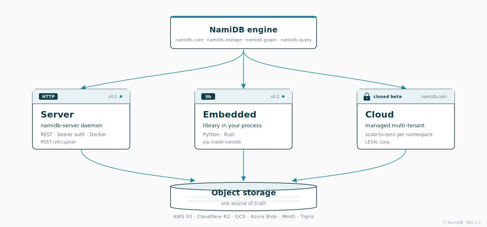
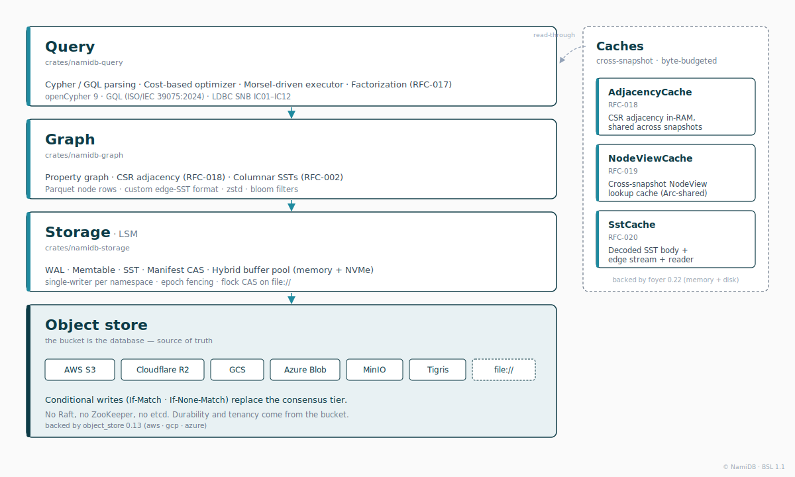

<div align="center">

<p>
  
</p>

# NamiDB

### Your graph database lives in your S3 bucket.

**Embedded like DuckDB. Multi-tenant by namespace. Built for the AI of this decade.**

[](LICENSE)
[](https://www.rust-lang.org)
[](https://pypi.org/project/namidb/)
[](crates/namidb-server/Dockerfile)
[](https://namidb.com)
[](https://docs.namidb.com)

[**Website**](https://namidb.com) · [**Documentation**](https://docs.namidb.com) · [**RFCs**](./docs/rfc/) · [**Request early access**](https://namidb.com)

</div>

---

> ### The graph is the shape of how things relate.

NamiDB is a graph database engine built from first principles for the era of object storage, columnar execution, and AI agents. One engine. Three deployments. Object storage is the source of truth.

<br />

## Why now

Three things changed. They changed everything.

**1. Object storage grew up.**
In 2024, S3 shipped conditional writes (`If-Match` / `If-None-Match`). The last missing primitive. For the first time, you can build a coordinated, durable system where object storage *is* the database — no Raft, no ZooKeeper, no etcd. The recipe has paid off for vectors, for queues, for analytics. It had not been done for graphs.

**2. The best columnar graph engine left the market.**
In October 2025, Apple acquired Kùzu and archived the repository. The most thoughtful columnar graph engine ever published went quiet. A hole opened.

**3. Agents need graphs.**
Vector search is necessary. It is not sufficient. Knowledge graphs are the substrate of agent memory, deep retrieval, and reasoning under uncertainty. The next decade of AI will run on relationships.

So we are building the database for that decade.

<br />

## The shape

**NamiDB writes Cypher to your S3 bucket.**

No control plane to provision. No Raft to tune. No etcd to babysit. Conditional writes (`If-Match` / `If-None-Match`) on object storage replace the consensus tier — the bucket itself is the source of truth. Your graph database is *just files in your bucket*: durability is whatever S3, R2, GCS, or Azure already give you; cost scales to zero when nobody queries; backups are `aws s3 sync`; tenants are folders.

The engine is the same whether you run it as a library inside your app, as a Rust daemon over HTTP, or on our hosted multi-tenant cloud — and it works equally well against **AWS S3**, **Cloudflare R2**, **GCS**, **Azure Blob**, **MinIO**, or your local disk.

<br />

## Three deployments, one engine

<p align="center">
  <picture>
    <source media="(prefers-color-scheme: dark)" srcset=".assets/namidb-deployments-dark.svg" />
    
  </picture>
</p>

| Mode | Status | Best for | How it ships |
|---|---|---|---|
| **Server** | ✅ v0.1 | **Self-hosted production over your S3 / R2 / GCS / Azure bucket** | `namidb-server` binary + Docker image |
| **Embedded** | ✅ v0.1 | Notebooks, single-process apps, local dev, CI fixtures | `pip install namidb` — talks to a bucket from inside your process |
| **Cloud** | 🔒 closed beta | Multi-tenant SaaS, agent memory, scale-to-zero per namespace | Managed by Fonles Studios on namidb.com — [request access](https://namidb.com) |

Same engine across all three. Server and Embedded write to the same bucket layout — you can boot an embedded notebook against the same `s3://…` URI a production daemon is serving.

<br />

## What's in the engine today

- **Cypher + GQL parsing** — strict subset of GQL (ISO/IEC 39075:2024) + openCypher 9. The 12 in-scope LDBC SNB Interactive Complex Read queries (IC01–IC12) parse, plan and execute end-to-end.
- **Writes via Cypher** — `CREATE`, `MERGE`, `SET`, `DELETE`, `DETACH DELETE`, `REMOVE`. Durable on `commit_batch` (WAL append + manifest CAS).
- **Cost-based optimizer** — predicate pushdown, projection pushdown, join reorder, hash-join conversion, hash semi-join (`EXISTS` decorrelation), Parquet row-group pruning. EXPLAIN VERBOSE prints the chosen plan with selectivity and cost annotations.
- **Vectorized execution** — morsel-driven executor with optional **factorized intermediate representation** (RFC-017) for path-heavy queries.
- **Columnar storage on object storage** — Parquet node SSTs, custom edge-SST format with CSR adjacency (RFC-002), zstd compression, bloom filters, fence-pointer indices.
- **Coordination-free correctness** — single-writer-per-namespace with epoch fencing via manifest CAS. Conditional writes (`If-Match`, `If-None-Match`) replace external consensus.
- **Tiered caches** — process-wide `AdjacencyCache` (CSR), `NodeViewCache`, and `SstCache` (decoded body + edge property streams + reader). Cross-snapshot reuse with `Arc`-shared, byte-budgeted memory.
- **Six storage backends** — `memory://`, `file://` (with `flock`-based CAS), `s3://` (AWS S3 / R2 / MinIO / Tigris / LocalStack), `gs://`, `az://`.
- **Python bindings** — `pip install namidb`, abi3 wheels for Linux (x86_64 + aarch64), macOS (arm64) and Windows (x86_64), with sdist fallback for other targets. Sync + async (`acypher`). Arrow / pandas / polars output.
- **CLI** — `namidb parse`, `namidb explain --verbose`, `namidb run --store <uri>` for ad-hoc query work against any backend.
- **HTTP server** — `namidb-server` binary with bearer-token auth, periodic flush loop, and a small REST API (`/v0/cypher`, `/v0/health`, `/v0/admin/flush`).
- **Bench harness** — synthetic, deterministic LDBC SNB Interactive harness with a paired Kùzu runner under [`bench/`](./bench/).

<br />

## Quickstart

Two doors. Both are the same engine.

### Door 1 — A real graph database in your S3 bucket

This is the headline use case. Point at a bucket, write Cypher,
durability is whatever S3 already gives you.

```bash
pip install namidb
export AWS_ACCESS_KEY_ID=AKIA...
export AWS_SECRET_ACCESS_KEY=...
```

```python
import namidb as tg

# Open (or bootstrap) the `prod` namespace on your bucket.
client = tg.Client("s3://my-bucket/data?ns=prod&region=us-east-1")

client.cypher("CREATE (a:Person {name: 'Alice', age: 30})")
client.cypher("CREATE (b:Person {name: 'Bob',   age: 25})")
client.cypher(
    "MATCH (a:Person {name: 'Alice'}), (b:Person {name: 'Bob'}) "
    "CREATE (a)-[:KNOWS {since: 2020}]->(b)"
)

result = client.cypher(
    "MATCH (p:Person) WHERE p.age >= $min RETURN p.name AS name, p.age AS age",
    params={"min": 18},
)
print(result.to_pandas())
```

Restart your process. Open a notebook on another machine with the
same URI. The graph is still there. **The bucket is the database.**

### Door 2 — 30-second taste, no credentials

For when you just want to feel the engine before pointing it at a
bucket. Ephemeral, in-process, no setup:

```python
import namidb as tg
client = tg.Client("memory://acme")
client.cypher("CREATE (a:Person {name: 'Alice'})")
print(client.cypher("MATCH (p:Person) RETURN p.name").rows())
```

Same six lines work against `file://`, `gs://`, `az://`, or any
S3-compatible endpoint — only the URI changes.

<br />

## Pick your storage backend

The URI tells the client which bucket and which namespace.

| Scheme | Backend |
|---|---|
| `s3://<bucket>[/<prefix>]?ns=<ns>` | **AWS S3, Cloudflare R2, MinIO, Tigris, LocalStack — anything S3-compatible** |
| `gs://<bucket>?ns=<ns>` | Google Cloud Storage |
| `az://<account>/<container>?ns=<ns>` | Azure Blob Storage |
| `file:///abs/dir?ns=<ns>` | Local filesystem (CAS via `flock` + atomic rename) |
| `memory://<ns>` | In-process, ephemeral — testing only |

Every backend supports the **same** Cypher, the **same** Python /
Rust / HTTP APIs, and the **same** snapshot-isolated read semantics.

### AWS S3 ⭐ the primary path

```python
import os
os.environ["AWS_ACCESS_KEY_ID"]     = "AKIA..."
os.environ["AWS_SECRET_ACCESS_KEY"] = "..."

client = tg.Client(
    "s3://my-bucket/data?ns=prod"
    "&region=us-west-2"
)
```

Credentials read from standard AWS env vars
(`AWS_ACCESS_KEY_ID`, `AWS_SECRET_ACCESS_KEY`, `AWS_SESSION_TOKEN`,
`AWS_DEFAULT_REGION`). IAM roles on EC2 / EKS / Lambda /
ECS work transparently — no NamiDB-specific auth to wire.

The only IAM permissions NamiDB needs on the bucket are
`s3:GetObject`, `s3:PutObject`, `s3:DeleteObject`, `s3:ListBucket`.
That's it. No DynamoDB lock table, no separate metadata service.

### Cloudflare R2 ⭐ the zero-egress alternative

R2 charges no egress, has full S3-compatible conditional writes, and
in our experience reads ~1.5–2× faster than S3 from outside AWS.
Same scheme, with the R2 endpoint and `region=auto`:

```python
import os
os.environ["AWS_ACCESS_KEY_ID"]     = "<R2 access key>"
os.environ["AWS_SECRET_ACCESS_KEY"] = "<R2 secret>"

client = tg.Client(
    "s3://my-bucket?ns=prod"
    "&endpoint=https://<ACCOUNT_ID>.r2.cloudflarestorage.com"
    "&region=auto"
)
```

If you're running NamiDB outside AWS — on Cloudflare Workers, Fly.io,
your own VPS, your laptop — **R2 is almost always the right call**.

### Other backends

Same `tg.Client(...)` call, just a different URI. Click for the
copy-paste credential snippet.

<details>
<summary><strong>Google Cloud Storage</strong> — <code>gs://</code></summary>

```python
import os
os.environ["GOOGLE_APPLICATION_CREDENTIALS"] = "/etc/gcs-key.json"
client = tg.Client("gs://my-bucket/data?ns=prod")
```

Service-account path can also be supplied per-URI:
`gs://my-bucket?ns=prod&service_account=/etc/gcs-key.json`.
</details>

<details>
<summary><strong>Azure Blob Storage</strong> — <code>az://</code></summary>

```python
import os
os.environ["AZURE_STORAGE_ACCOUNT_NAME"] = "myacct"
os.environ["AZURE_STORAGE_ACCESS_KEY"]   = "..."
client = tg.Client("az://myacct/mycontainer?ns=prod")
```

For Azurite (the local emulator) append `&use_emulator=true`.
</details>

<details>
<summary><strong>MinIO</strong> (self-hosted S3) — <code>s3://</code> with <code>endpoint=…</code></summary>

```bash
docker run -d --rm -p 9000:9000 -p 9001:9001 \
  -e MINIO_ROOT_USER=minioadmin -e MINIO_ROOT_PASSWORD=minioadmin \
  --name minio minio/minio server /data --console-address ":9001"
docker exec minio mc alias set local http://127.0.0.1:9000 minioadmin minioadmin
docker exec minio mc mb local/namidb
```

```python
import os
os.environ["AWS_ACCESS_KEY_ID"]     = "minioadmin"
os.environ["AWS_SECRET_ACCESS_KEY"] = "minioadmin"
client = tg.Client(
    "s3://namidb?ns=dev"
    "&endpoint=http://127.0.0.1:9000"
    "&region=us-east-1"
    "&allow_http=true"
)
```

For the production-style **MinIO + `namidb-server` + docker-compose** stack,
see [Self-host as a database](#self-host-as-a-database) below.
</details>

<details>
<summary><strong>LocalStack</strong> (S3 mock for tests) — <code>s3://</code> with <code>endpoint=…</code></summary>

```bash
docker run -p 4566:4566 -e SERVICES=s3 localstack/localstack
aws --endpoint-url=http://localhost:4566 s3 mb s3://namidb-dev
export AWS_ACCESS_KEY_ID=test AWS_SECRET_ACCESS_KEY=test
```

```python
client = tg.Client(
    "s3://namidb-dev?ns=local"
    "&endpoint=http://localhost:4566"
    "&allow_http=true"
    "&region=us-east-1"
)
```
</details>

<details>
<summary><strong>Local filesystem</strong> — <code>file://</code></summary>

For CI fixtures or single-machine dev when you want durability without
a bucket. Full manifest CAS via per-namespace `flock` + atomic
`rename(2)`.

```python
client = tg.Client("file:///var/lib/namidb?ns=prod")
# relative paths work too:
client = tg.Client("file://./data?ns=dev")
```
</details>

<br />

## Self-host as a database

There are two ways to run NamiDB as a database you own end-to-end —
pick the one that matches how your app wants to talk to it.

### Option A — Embedded library + your bucket

Your application (Python or Rust) imports NamiDB directly and points
at a bucket you control. Lowest latency, no extra hop, no network
boundary, no auth surface. The "DuckDB for graphs" mode.

```python
# Python service
import namidb as tg
client = tg.Client("s3://your-bucket/data?ns=prod&region=us-east-1")
result = client.cypher("MATCH (n:Person) RETURN count(n) AS n")
```

```rust
// Rust service
use namidb::{
    core::id::NamespaceId,
    storage::{parse_uri, WriterSession},
};

let (store, paths) = parse_uri("s3://your-bucket/data?ns=prod")?;
let mut writer = WriterSession::open(store, paths).await?;
// upserts, commit_batch, snapshot reads…
```

Best when your read fan-out fits in one process and you want zero
network overhead. **Object storage is the source of truth**, so two
replicas of your service can independently open the same namespace —
NamiDB's epoch-CAS protocol fences out stale writers automatically.

### Option B — `namidb-server` daemon + REST

A single Rust binary (or container image) opens a namespace and
exposes it over HTTP. Best when the database lives on a different
machine than the app, or you want a network boundary with bearer-
token auth.

```bash
# Install from source
cargo install --path crates/namidb-server

# Or build the Docker image (from the repo root)
docker build -t namidb-server:0.1 -f crates/namidb-server/Dockerfile .
```

```bash
namidb-server \
  --store s3://your-bucket/data?ns=prod&region=us-east-1 \
  --listen 0.0.0.0:8080 \
  --auth-token "$NAMIDB_AUTH_TOKEN"
```

```bash
curl -X POST http://your-host:8080/v0/cypher \
  -H "Authorization: Bearer $NAMIDB_AUTH_TOKEN" \
  -H 'Content-Type: application/json' \
  -d '{"query": "MATCH (n:Person) RETURN count(n) AS n"}'
# {"columns":["n"],"rows":[{"n": 42}]}
```

See [`crates/namidb-server/README.md`](./crates/namidb-server/README.md)
for the full route reference (`/v0/cypher`, `/v0/health`,
`/v0/version`, `/v0/admin/flush`), JSON ↔ Cypher type mapping, and
concurrency model.

### Recipe — `docker-compose` with MinIO + `namidb-server`

A complete, self-contained self-hosted database in one file. Bring
your own auth token; everything else is wired:

```yaml
# docker-compose.yml
services:
  minio:
    image: minio/minio
    command: server /data --console-address ":9001"
    environment:
      MINIO_ROOT_USER: minioadmin
      MINIO_ROOT_PASSWORD: minioadmin
    volumes:
      - minio-data:/data
    healthcheck:
      test: ["CMD", "mc", "ready", "local"]
      interval: 3s
      retries: 30

  bucket-init:
    image: minio/mc
    depends_on:
      minio:
        condition: service_healthy
    entrypoint: >
      sh -c "
        mc alias set local http://minio:9000 minioadmin minioadmin &&
        mc mb --ignore-existing local/namidb
      "

  namidb-server:
    image: namidb-server:0.1   # built from crates/namidb-server/Dockerfile
    depends_on:
      bucket-init:
        condition: service_completed_successfully
    environment:
      NAMIDB_STORE: "s3://namidb?ns=prod&endpoint=http://minio:9000&region=us-east-1&allow_http=true"
      NAMIDB_LISTEN: "0.0.0.0:8080"
      NAMIDB_AUTH_TOKEN: "${NAMIDB_AUTH_TOKEN:?set NAMIDB_AUTH_TOKEN in your env}"
      NAMIDB_FLUSH_INTERVAL: "30s"
      AWS_ACCESS_KEY_ID: "minioadmin"
      AWS_SECRET_ACCESS_KEY: "minioadmin"
    ports:
      - "8080:8080"

volumes:
  minio-data: {}
```

```bash
export NAMIDB_AUTH_TOKEN=$(openssl rand -hex 32)
docker compose up -d
curl -s http://localhost:8080/v0/health | jq .
```

That's it. A graph database, your data on disk in MinIO, an
authenticated REST API on `:8080`. Swap the `NAMIDB_STORE` URI to
move the same setup to AWS S3, R2, GCS, or Azure without touching
anything else.

<br />

## CLI

```bash
# Ephemeral in-memory namespace — same as before.
namidb run "CREATE (a:Person {name: 'Alice'}), (b:Person {name: 'Bob'})"
namidb run "MATCH (p:Person) RETURN p.name"

# Persistent — any URI scheme is accepted.
namidb run --store "file:///var/lib/namidb?ns=prod" \
  "CREATE (a:Person {name: 'Alice'})"
namidb run --store "file:///var/lib/namidb?ns=prod" \
  "MATCH (p:Person) RETURN p.name"

namidb run --store "s3://my-bucket/data?ns=prod&region=us-west-2" \
  "MATCH (p:Person) RETURN count(*) AS n"

# Plan inspection — does not touch storage.
namidb explain --verbose \
  "MATCH (a:Person)-[:KNOWS]->(b) RETURN b ORDER BY b.id LIMIT 20"
```

See [`crates/namidb-cli/README.md`](./crates/namidb-cli/README.md)
for every subcommand.

<br />

## Rust (embedded)

```rust
use std::sync::Arc;

use namidb_core::id::NamespaceId;
use namidb_query::{execute, lower, parse, Params};
use namidb_storage::{parse_uri, WriterSession};

#[tokio::main]
async fn main() -> anyhow::Result<()> {
    // Any supported URI scheme — memory://, file://, s3://, gs://, az://.
    let (store, paths) = parse_uri("memory://demo")?;
    let mut writer = WriterSession::open(store, paths).await?;

    // ... upsert nodes / edges, then commit_batch + flush ...

    let snap = writer.snapshot();
    let query = parse("MATCH (a:Person) RETURN count(*) AS n")?;
    let plan  = lower(&query)?;
    let rows  = execute(&plan, &snap, &Params::new()).await?;

    println!("{rows:?}");
    Ok(())
}
```

The umbrella crate ([`crates/namidb/`](./crates/namidb/)) re-exports
the stable surface so a downstream `Cargo.toml` only needs one line.

<br />

## Architecture

<p align="center">
  <picture>
    <source media="(prefers-color-scheme: dark)" srcset=".assets/namidb-architecture-dark.svg" />
    
  </picture>
</p>

```
┌─────────────────────────────────────────────────────────────────────┐
│  Cypher · GQL (ISO/IEC 39075:2024)                                  │
│  Cost-based optimizer · Morsel-driven executor · Factorization      │
├─────────────────────────────────────────────────────────────────────┤
│  Property graph · CSR adjacency · Columnar SSTs                     │
├─────────────────────────────────────────────────────────────────────┤
│  LSM tree · WAL · Memtable · SST · Manifest CAS                     │
│  Hybrid buffer pool (memory + NVMe)                                 │
├─────────────────────────────────────────────────────────────────────┤
│  S3 · R2 · GCS · Azure Blob · MinIO · Tigris · Local FS             │
└─────────────────────────────────────────────────────────────────────┘
```

Design proposals live in [`docs/rfc/`](./docs/rfc/). Start with
[RFC-001 — Storage Engine](./docs/rfc/001-storage-engine.md) and
[RFC-002 — SST Format](./docs/rfc/002-sst-format.md).

<br />

## Configuration

Tunable env vars. Defaults are sane for most workloads; reach for
these when you are debugging performance or memory.

| Env var | Default | What it does |
|---|---|---|
| `NAMIDB_ADJACENCY` | ON | CSR adjacency in-RAM, shared across snapshots (RFC-018). |
| `NAMIDB_NODE_CACHE` | ON | Cross-snapshot `NodeView` lookup cache (RFC-019). |
| `NAMIDB_SST_CACHE` | ON | SST body + decoded edge property streams + parsed `EdgeSstReader` (RFC-020). |
| `NAMIDB_FACTORIZE` | OFF | Factorized intermediate results in the executor (RFC-017). |
| `NAMIDB_PROFILE_DUMP` | OFF | Dump per-stage profile counters to stderr after each query. |

`namidb-server` adds its own:

| Env var | Default | What it does |
|---|---|---|
| `NAMIDB_STORE` | — (required) | Storage URI (e.g. `s3://bucket?ns=prod`). |
| `NAMIDB_LISTEN` | `0.0.0.0:8080` | TCP bind address. |
| `NAMIDB_AUTH_TOKEN` | unset (open) | Bearer token; when unset the server warns and accepts all requests. |
| `NAMIDB_FLUSH_INTERVAL` | `30s` | Background memtable → L0 flush cadence. `0s` disables. |

<br />

## Repository layout

```
.
├── Cargo.toml              # Workspace manifest
├── rust-toolchain.toml     # Pinned toolchain
├── LICENSE                 # BSL 1.1 (auto-converts to Apache 2.0)
├── README.md
├── CONTRIBUTING.md
├── docs/
│   └── rfc/                # Design proposals (RFC-001 → RFC-020)
├── crates/
│   ├── namidb-core/        # Common types, errors, schema
│   ├── namidb-storage/     # LSM, WAL, manifest, SST, memtable, URI parser, file:// CAS
│   ├── namidb-graph/       # Property columns + CSR adjacency
│   ├── namidb-query/       # Cypher / GQL parser, optimizer, executor
│   ├── namidb-cli/         # `namidb` command-line tool
│   ├── namidb-py/          # Python bindings (PyO3 + maturin)
│   ├── namidb-server/      # `namidb-server` HTTP daemon + Dockerfile
│   ├── namidb-bench/       # LDBC-shaped synthetic bench harness
│   └── namidb/             # Public façade crate
├── bench/                  # Kùzu runner + cross-engine comparator
└── tests/                  # Integration helpers (LocalStack, R2 wrapper)
```

<br />

## Documentation

| Resource | Where |
|---|---|
| **Website** | [namidb.com](https://namidb.com) |
| **Reference docs & guides** | [docs.namidb.com](https://docs.namidb.com) |
| **Design RFCs** | [`docs/rfc/`](./docs/rfc/) |
| **Python bindings** | [`crates/namidb-py/README.md`](./crates/namidb-py/README.md) |
| **HTTP server** | [`crates/namidb-server/README.md`](./crates/namidb-server/README.md) |
| **CLI** | [`crates/namidb-cli/README.md`](./crates/namidb-cli/README.md) |
| **Benchmark harness** | [`bench/README.md`](./bench/README.md) |

<br />

## Roadmap

- **Cloud (closed beta)** — multi-tenant SaaS on namidb.com with
  per-namespace scale-to-zero, encrypted-at-rest tenants, and a hosted
  control plane. [Request access](https://namidb.com).
- **Streaming responses** — `/v0/cypher/stream` (NDJSON) and
  `/v0/cypher/arrow` (Arrow IPC) for zero-copy DataFrame ingestion.
- **Bolt protocol** — wire compatibility with Neo4j drivers (Python,
  Java, JS, …) sitting on top of the same engine.
- **Concurrent reads** — RFC-021 removes the single-writer mutex
  from the read path so a `namidb-server` can fan out reads to every
  core.

<br />

## Contributing

We develop in the open. Read [`CONTRIBUTING.md`](./CONTRIBUTING.md) and
the RFCs in [`docs/rfc/`](./docs/rfc/). All non-trivial design changes
go through an RFC.

<br />

## License

NamiDB is licensed under the [**Business Source License 1.1**](LICENSE).

- Free for development, testing, internal production use, and any use
  that does not compete with a hosted NamiDB offering from the
  Licensor.
- Automatically converts to **Apache License 2.0** three years after
  each release.
- A separate commercial license is available for teams that need to
  embed or redistribute NamiDB outside the bounds of BSL — including
  offering it as a hosted database service. Contact
  [`info@namidb.com`](mailto:info@namidb.com).

<br />

## Acknowledgements

NamiDB stands on the shoulders of giants:

- **Kùzu** — for showing that columnar storage + CSR adjacency +
  factorization is the right model for property graphs.
- **SlateDB** — for the canonical recipe for LSM trees on object
  storage.
- **turbopuffer** — for proving namespace-per-tenant on S3 is a viable
  SaaS architecture.
- **Apache Arrow / Parquet / DataFusion** — for the columnar
  foundation.
- **foyer-rs** — for the hybrid memory + disk cache.

<br />

---

<div align="center">

### The graph is the shape of how things relate.

<sub>NamiDB is a product of <a href="https://namidb.com"><b>Fonles Studios, Corp.</b></a> — Delaware, USA.</sub><br />
<sub>© 2026 Fonles Studios, Corp. All rights reserved.</sub>

</div>
